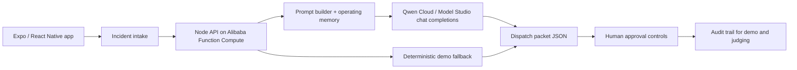

# DispatchPilot Architecture

## Runtime path

1. The dispatcher enters a field-service incident in the Expo app.
2. The API adds operating memory: customer preferences, crew skills, site constraints, inventory, and escalation rules.
3. Qwen Cloud returns a structured dispatch packet.
4. The app renders severity, crew assignment, parts checklist, customer update, runbook, memory hits, and approval controls.
5. Customer-visible actions remain pending until a manager approves them.

## Sponsor technology

- **Qwen Cloud / Alibaba Cloud Model Studio:** `api/src/qwenClient.ts` calls the OpenAI-compatible chat completions endpoint.
- **Alibaba Cloud Function Compute:** `deploy/alibaba-function-compute.yaml` defines the planned HTTP backend deployment.
- **Submission diagram:** `docs/architecture.svg` and `docs/architecture.png`.

## Demo mode

If `DASHSCOPE_API_KEY` is missing or a live call fails, the API returns the same schema through `src/lib/agentEngine.ts`. This keeps the app runnable without spending cloud credits, while live mode can be verified with one Qwen call before submission.
